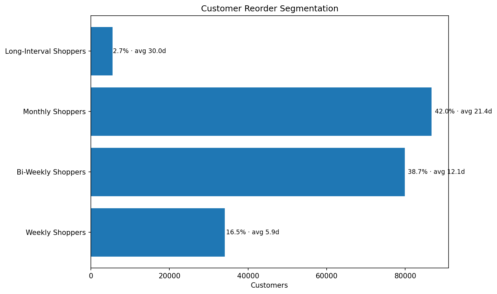
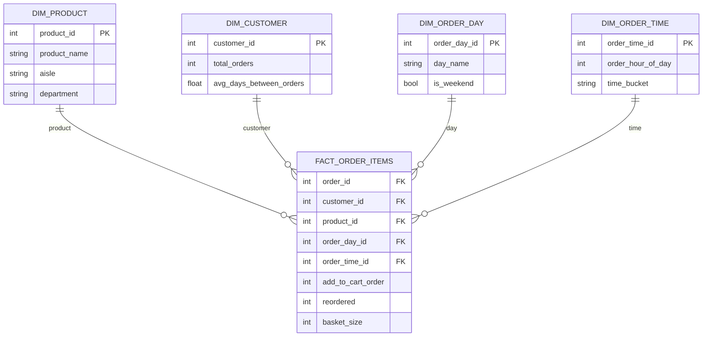

# retailanalyticplatform

# Retail Analytic Platform – Instacart Market Basket


Retail analytics project based on the Instacart Market Basket dataset.

The objective is to build a complete analytics pipeline including:

- data ingestion
- data modeling with a star schema
- retail analytics
- market basket analysis
- customer analytics
- demand forecasting

## What This Project Demonstrates

This project demonstrates practical experience with:

- analytical data modeling
- SQL-based data marts
- customer behavior analysis
- retail demand diagnostics
- time-series preparation under imperfect data constraints
- forecasting baselines and trend projection
- automated business-facing reporting

## Customer Reorder Behavior

One of the key insights from the Instacart dataset is the presence of
distinct grocery shopping rhythms across customers.



Customers naturally cluster around three primary ordering cycles:

- weekly shoppers (~7 days)
- bi-weekly shoppers (~14 days)
- monthly shoppers (~30 days)

This pattern reflects typical household replenishment behavior and
explains many of the demand patterns observed in the dataset.

## Dataset

Source: Kaggle – Instacart Market Basket Analysis

The dataset contains over:

- 3.4 million orders
- 200k customers
- 50k products
- 30+ million order-product relationships

Files used:

- `orders.csv`
- `products.csv`
- `aisles.csv`
- `departments.csv`
- `order_products__prior.csv`
- `order_products__train.csv`

## Project Architecture

```text
Kaggle Dataset
      ↓
Python Ingestion
      ↓
DuckDB
      ↓
Star Schema
      ↓
Analytical Views
      ↓
Retail Analytics
      ↓
Market Basket Analysis
      ↓
Customer Analytics
      ↓
Demand Trend Analysis
      ↓
Forecasting Preparation
      ↓
Forecasting Models
```

### Dataset Constraints

Important limitations of the source data:

- `days_since_prior_order` is capped at **30 days**
- true calendar dates are **not available**
- time-series analysis must therefore rely on a **reconstructed relative timeline**

These constraints directly influence forecasting design and interpretation.

## Data Model

The analytical model is built around the order-item grain:

1 row = 1 product in 1 order

This grain supports:

- basket size analysis
- product popularity analysis
- reorder behavior analysis
- customer segmentation
- market basket analysis
- time-based order exploration

## Retail Analytics

Retail analytics is generated from aggregated reporting views built on top of the star schema.

The following datasets are exported for analytical exploration:

- basket size distribution
- orders by day of week
- orders by hour of day
- product popularity
- department demand
- customer ordering behavior

These aggregated datasets are visualized using Python and Matplotlib.

Visualizations include:

- basket size distribution
- orders by day of week
- orders by hour of day
- top products
- top departments
- customer order frequency distribution

## Market Basket Analysis

Market Basket Analysis identifies relationships between products frequently purchased together.

The analysis is built on the order-item fact table and computes association rules between products using DuckDB.

Key metrics include:

- support
- confidence
- lift

The association rules enable identification of:

- frequently bought together products
- cross-sell opportunities
- strong product affinities

The results are exported as CSV and visualized using Python and Matplotlib.

## Customer Analytics

Customer Analytics focuses on understanding behavioral patterns across the customer base.

The analysis uses aggregated customer metrics derived from the order-item fact table.

Key customer metrics include:

- total orders per customer
- reorder rate
- average basket size
- average days between orders

Customers are grouped into behavioral segments based on ordering frequency, enabling identification of:

- occasional buyers
- regular customers
- high-frequency users
- power users

Customer analytics visualizations include:

- purchase frequency distribution
- reorder rate distribution
- orders vs reorder rate
- customer segmentation
- basket size by segment
- ordering cadence by segment
- basket size distribution

The results are exported as CSV datasets and visualized using Python and Matplotlib.

## Demand Forecasting

The forecasting module introduces time-based demand analysis using a reconstructed
temporal axis derived from customer order sequences.

Because the Instacart dataset does not contain explicit calendar dates,
a **relative time model** was created using the `days_since_prior_order`
field to rebuild a chronological order timeline.

This allows demand trend analysis and forecasting preparation even without
true timestamps.

### Relative Time Model

Orders are enriched with:

- `relative_day_index`
- `relative_week_index`

These fields represent the reconstructed position of an order within a
customer's lifecycle.

This enables:

- weekly demand trend analysis
- product demand evolution
- department demand comparison
- demand cycle detection
- customer cohort analysis

### Demand Trend Analysis

Demand trends are analyzed using aggregated weekly datasets.

Analyses include:

- product demand trends
- department demand trends
- top products by demand
- top departments by demand
- weekly demand evolution

### Time-Series Diagnostics

Several statistical diagnostics are applied before forecasting:

- demand autocorrelation analysis (ACF)
- STL trend and seasonality decomposition
- demand anomaly detection
- relative demand cycle analysis

These diagnostics help evaluate the structure of demand signals before applying forecasting models.

### Customer Behavior & Demand Drivers

Customer ordering behavior strongly influences demand patterns.

Customer behavior analysis includes:

- reorder interval distribution
- capped reorder interval detection (dataset limitation)
- customer reorder segmentation
- customer lifetime ordering curve
- customer reorder cohort analysis

These analyses reveal typical grocery shopping cycles such as:

- weekly shoppers (~7 days)
- bi-weekly shoppers (~14 days)
- monthly shoppers (~30 days)

### Forecasting Baselines

Several baseline forecasting approaches are implemented:

- **4-week moving average forecast**
- **ARIMA diagnostic models**
- **Prophet trend projection**

Because real timestamps are unavailable, Prophet uses a **pseudo-weekly date index**
derived from the relative week index.

Therefore forecasts should be interpreted as **relative demand projections rather than real calendar forecasts**.

### Visualizations

Forecasting analysis produces several visualizations:

- product demand trends
- department demand trends
- moving average forecast
- weekly demand evolution
- demand anomaly detection
- replenishment cycle pattern
- product demand heatmap
- demand autocorrelation (ACF)
- STL decomposition
- reorder interval distribution
- customer reorder segmentation
- customer lifetime ordering curve
- customer reorder cohorts
- product demand seasonality index
- Prophet forecast

## Star schema

The analytical model follows a classic **star schema** centered on the
`fact_order_items` table at the **order-item grain**.

Each row represents:

1 product × 1 order × 1 customer × 1 timestamp



## Retail Analytics Report

An automated HTML analytics report is generated from the visualization pipeline.

The report includes:

- key retail metrics
- customer behavior insights
- product demand analysis
- temporal order patterns

Features:

- KPI summary
- visualization grid
- interactive image zoom
- responsive layout

Example report structure:

```text
Retail Analytics Report
│
├── Key Metrics
│
├── Orders by Day
├── Orders by Hour
├── Basket Size Distribution
├── Top Products
├── Top Departments
└── Customer Order Distribution
```

## Market Basket Analysis Report

An automated HTML report is generated from the association rule analysis.

The report includes:

- key association metrics
- strongest product associations
- lift distribution
- support vs confidence analysis
- cross-sell opportunities

The report provides an interactive visualization layout with image zoom for detailed inspection.

## Customer Analytics Report

An automated HTML report is generated from the customer analytics pipeline.

The report includes:

- key customer metrics
- behavioral segmentation
- reorder behavior analysis
- basket size analysis
- purchase frequency analysis

Features:

- KPI summary
- behavioral insights
- visualization grid
- interactive image zoom
- responsive layout

Example report structure:

```text
Customer Analytics Report
│
├── Key Metrics
│
├── Purchase Frequency Distribution
├── Reorder Rate Distribution
├── Orders vs Reorder Rate
├── Customer Segmentation
├── Basket Size by Segment
├── Ordering Frequency by Segment
└── Basket Size Distribution
```

## Demand Forecasting Report

An automated HTML report is generated from the forecasting pipeline.

The report includes:

- demand trend KPIs
- product demand evolution
- department demand comparison
- demand distribution insights

Features:

- KPI summary
- visualization grid
- interactive image zoom
- responsive layout

## Current Progress

Completed:

Data ingestion
- Instacart dataset downloaded from Kaggle
- raw CSV files stored in `data/raw`
- data loaded into DuckDB

Data modeling
- analytical star schema created in the `mart` schema
- fact table at the order-item grain
- product, customer, day and time dimensions

Retail analytics
- aggregated reporting views
- CSV exports for analytics
- Python visualizations
- automated HTML analytics report

Market basket analysis
- product pair generation
- association rule computation
- support, confidence and lift metrics
- cross-sell opportunity analysis
- automated HTML report with interactive visualizations

Customer analytics
- customer behavior metrics
- purchase frequency analysis
- reorder behavior analysis
- customer segmentation
- automated HTML report with behavioral insights

Demand forecasting
- relative time reconstruction
- weekly demand aggregation
- moving average baseline forecast
- demand anomaly detection
- replenishment cycle analysis
- demand autocorrelation (ACF)
- STL demand decomposition
- customer reorder interval analysis
- customer reorder segmentation
- customer lifetime ordering curve
- customer reorder cohort analysis
- product demand seasonality index
- Prophet trend forecasting
- automated HTML forecasting report

## Repository Structure

```text
retail-analytic-platform
│
├── data
│   ├── raw
│   ├── warehouse
│   └── exports
│       ├── association_rules.csv
│
├── ingestion
│
├── modeling
│   ├── star_schema.sql
│   └── analytical_views.sql
│
├── analytics
│   ├── validation.sql
│   ├── export_views.sql
│   ├── retail_visualizations.py
│   ├── market_basket_visualizations.py
│   ├── customer_visualizations.py
│   └── demand_forecasting_visualizations.py
│
├── reports
│   ├── figures
│   ├── retail_analytics_report.html
│   ├── market_basket_report.html
│   ├── customer_analytics_report.html
│   └── demand_forecasting_report.html
│
├── notebooks
│
└── README.md
```

## Future Forecasting Enhancements

Planned improvements for the forecasting module include:

- advanced ARIMA demand forecasting
- probabilistic demand forecasting
- forecast accuracy metrics (MAE, RMSE)
- demand anomaly detection using statistical models
- product association demand forecasting
- market basket demand interaction analysis
- demand forecasting dashboards
	
## Technologies

```markdown
- Python
- DuckDB
- Pandas
- Matplotlib
- HTML/CSS
- Kaggle dataset
```

## Example Visualization

Example visualizations generated by the pipeline:

- basket size distribution
- orders by hour
- top products
- department demand
- customer order distribution

The full visualization set is available in the generated HTML analytics report.

## Business Insights

The project surfaces several retail-relevant insights from Instacart transaction data:

- **Produce dominates category demand**, making it the strongest driver of basket activity.
- **Bananas represent a disproportionately large share of product demand**, illustrating the importance of staple-item forecasting.
- Customer ordering behavior clusters around **weekly, bi-weekly, and monthly shopping rhythms**.
- The large spike at **30 days** in reorder intervals must be interpreted carefully because the source dataset caps `days_since_prior_order` at 30.
- Aggregate demand declines in later relative weeks largely because **fewer customers remain observable over time**, not necessarily because demand collapses.
- Time-series diagnostics suggest that the reconstructed demand series shows **trend structure with limited seasonality**, making it more suitable for trend projection than calendar-seasonal forecasting.
- Forecasting outputs should therefore be interpreted as **relative demand projections** rather than real-world calendar forecasts.
