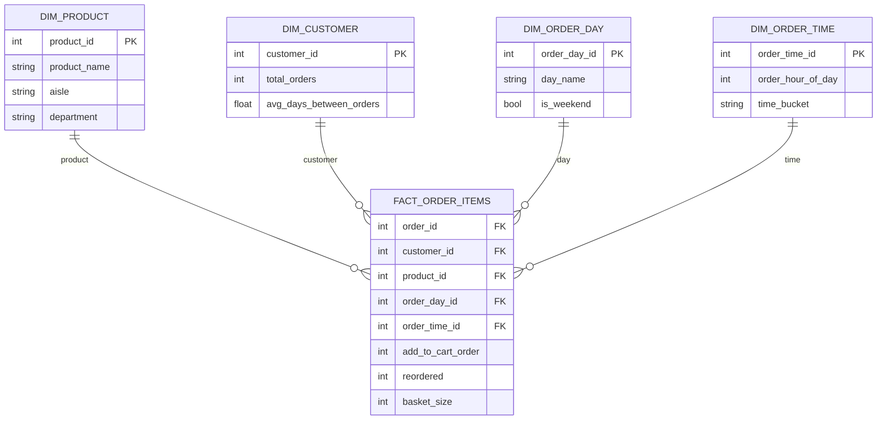

# retailanalyticplatform

# Retail Analytic Platform – Instacart Market Basket


Retail analytics project based on the Instacart Market Basket dataset.

The objective is to build a complete analytics pipeline including:

- data ingestion
- data modeling with a star schema
- retail analytics
- market basket analysis
- customer analytics
- demand forecasting

This project demonstrates practical data engineering and business intelligence workflows using Python and DuckDB.

## Dataset

Source: Kaggle – Instacart Market Basket Analysis

The dataset contains over:

- 3.4 million orders
- 200k customers
- 50k products
- 30+ million order-product relationships

Files used:

- `orders.csv`
- `products.csv`
- `aisles.csv`
- `departments.csv`
- `order_products__prior.csv`
- `order_products__train.csv`

## Project Architecture

```text
Kaggle Dataset
      ↓
Python Ingestion
      ↓
DuckDB
      ↓
Star Schema
      ↓
Analytical Views
      ↓
Retail Analytics
      ↓
Market Basket Analysis
      ↓
Customer Analytics
      ↓
Forecasting
```

## Data Model

The analytical model is built around the order-item grain:

1 row = 1 product in 1 order

This grain supports:

- basket size analysis
- product popularity analysis
- reorder behavior analysis
- customer segmentation
- market basket analysis
- time-based order exploration

## Star schema

The analytical model follows a classic **star schema** centered on the
`fact_order_items` table at the **order-item grain**.

Each row represents:

1 product × 1 order × 1 customer × 1 timestamp



## Current Progress

Completed so far:

- Instacart dataset downloaded
- raw files stored in data/raw
- source files loaded into DuckDB
- analytical star schema implemented in the mart schema
- fact table built at the order-item grain
- dimensions created:
	- dim_product
	- dim_customer
	- dim_order_day
	- dim_order_time
- analytical reporting views created:
      - v_customer_summary
      - v_product_summary
      - v_orders_by_day
      - v_orders_by_hour3
- basic validation queries implemented

## Repository Structure

```text
retail-analytic-platform
│
├── data
│   ├── raw
│   ├── warehouse
│   └── exports
│
├── ingestion
│
├── modeling
│   ├── star_schema.sql
│   └── analytical_views.sql
│
├── analytics
│   ├── validation.sql
│   └── export_views.sql
│
├── notebooks
│
└── README.md
```

## Planned Analyses

- Retail Analytics
	- average basket size
	- most popular products
	- department-level product demand
	- purchase patterns by day of week and hour of day
- Market Basket Analysis
	- product association rules
	- frequently bought together products
	- cross-sell opportunities
- Customer Analytics
	- purchase frequency
	- reorder behavior
	- customer segmentation
- Forecasting
	- product demand forecasting
	- department-level demand trends
	
## Technologies

- Python
- DuckDB
- Pandas
- Matplotlib
- Kaggle dataset

## Example Visualization

Coming soon.
